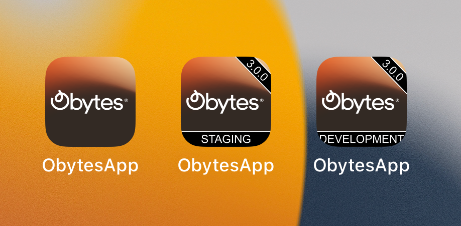

<p align="center">
    
</p>
<h1 align="center">
App Icon Badge
</h1>
<p align="center">
✨ Easily generate icons with environment and version badges for your Mobile application. ✨
</p>

<hr/>

## 👀 Overview

The library uses [Jimp](https://www.npmjs.com/package/jimp), an image-processing library for Node with zero native dependencies, to generate app icons with environment or version badges.

This Library was built to work with expo projects, but it can also be used in any React Native project and as a standalone library to generate icons with badges.

> Worth mentioning that this library was built to be added to the build process of our react native starter kit [Obytes Starter](https://starter.obytes.com/). The starter kit is based on the best practices and tools that we have found to be most effective in our own projects and it comes with this library pre-installed and configured. Make sure to give it a try if you are looking for a React Native starter kit.

## 🚀 Motivation

During the development of a mobile application, we typically generate different applications based on the environment (staging, development, production).

However, it starts getting confusing when we install all of them on our device, especially if they have the same icon and name. In addition to that, it is difficult for our testers to trace bugs not knowing which version of the application they are using.

Therefore, we need a way to differentiate the applications based on the environment and version. This library generates a badge with the environment and version information and adds it to the app icon.

## 📦 Installation

Install the package.

```bash
## Using yarn
yarn add app-icon-badge
## Using npm
npm install app-icon-badge
## Using pnpm
pnpm add app-icon-badge
```

## 🛠️ Usage

### As an Expo Plugin

As we mentioned above, we built the package to be used in Expo projects and generate icons that will be provided to the `icon` property in `app.json`. You can learn more about that in the [Expo documentation](https://docs.expo.dev/develop/user-interface/app-icons).

We found out that the best possible way to generate these icons during `prebuild` is to use an [Expo plugin](https://docs.expo.dev/modules/config-plugin-and-native-module-tutorial/#4-creating-a-new-config-plugin).

Adding our plugin will guarantee that the icon is generated every time you run prebuild.

```javascript
// app.config.js
const environment = 'staging'; // should be dynamic based on the environment

export default ({ config }) => ({
  // your config here ...
  ...config,
  name: 'my-app',
  icon: `./assets/icon.${environment}.png`,
  plugins: [
    [
      'app-icon-badge',
      {
        iconPath: './assets/icon.png',
        environment,
        enabled: true, // make sure to add condition to disable it for production builds
      },
    ],
  ],
});
```

The app icon size should be 1024x1024 and we recommend following the [Expo guidelines](https://docs.expo.dev/develop/user-interface/app-icons) to generate the icon.

The plugin will generate a new icon with the environment as a suffix, like the following `./assets/icon.${environment}.png`, in the same directory as the original icon. then the new icon will be used in the `icon` and after the prebuild is done, all native assets will be generated with the new icon.

You can enable/disable the plugin by setting the `enabled` property to `true` or `false`. You would usually want to disable it for production builds.

> Note: if for some reason you fill lost 🙃 and don't know how to use the plugin, please refer to our starter for a complete working example.

### As a library

We also wanted to make it possible to use the library in any React Native project, so we added the ability to use it as a library, but it's up to you to make it work with the build process you are using.

```javascript
import { addIconBadge } from 'app-icon-badge';
import path from 'path';

const iconPath = path.resolve(__dirname, './assets/icon.png');

addIconBadge({
  iconPath,
  version: '3.0.0',
  environment: 'development',
});
```

If you would like to only generate an icon with the version badge, you can skip passing the `environment` argument. The same applies to the `version` argument.

## 🚧 RoadMap

The library is still in its early stages. We have a lot of ideas to improve it and make it more useful. Here are some of the things we have already had the chance to implement, as well as our plans for additions in the future:

- [x] Generate icons with environment & version badges for ios
- [x] Expo plugin
- [x] publish the library to npm
- [ ] Add support for Android Adaptive Icons
- [ ] Add Tests
- [ ] Add support for custom badge colors
- [ ] Add the ability to run as a CLI tool

Feel free to suggest any other features or contribute to the project yourself by helping us implement upcoming features.

## 🔥 How to contribute?

We appreciate your desire to support our effort. We highly value your participation and look forward to receiving your contributions.

If you decided that you would like to contribute, you can follow these steps:

1. Fork the repository.
2. Create your feature branch (git checkout -b my-new-feature).
3. Install dependencies, we use pnpm, please make sure to [install](https://pnpm.io/installation) it, if you don't have it already.

```bash
cd app-icon-badge
pnpm install
```

4. Run the example provided in the `example` directory. You should see a new icon with the badge generated in the same directory as the original icon under the name `icon.development.png`.

```bash
pnpm start
```

5. Make your changes and make sure the example is running without any issues.
6. Commit & push your changes then open a new Pull Request.

Feel free to open an issue if you have a suggestion, question, or feedback.

If our project has helped you in any way, please consider giving it a star ⭐️.

## 📝 License

This project is MIT licensed.
